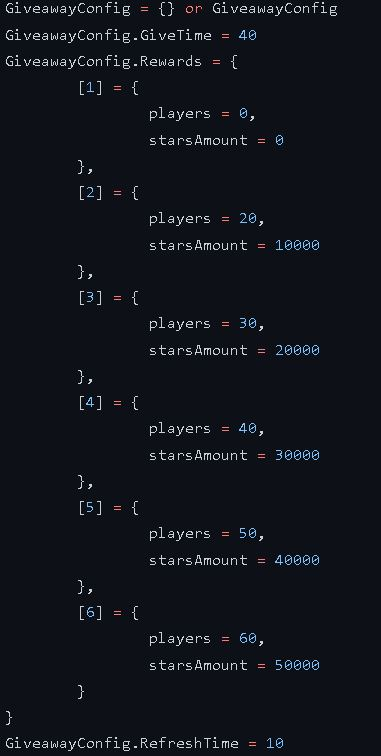

# **DarkRP.fr - Giveaway System**

> Auteur : CZARKOWSKI Matthieu (la_ref)

## **Le projet 📢**

Système de giveaway pour mon serveur DarkRP.fr sur le jeu Garry's mod.

Le principe est que toutes les heures pour chaque palier de joueurs atteint 
à la fin du timer un joueur sera séléctionner de manière aléatoire et sera récompenser d'une somme en argent virtual sur DarkRP.


## **Les prérequis 📍**

Le jeu Garry's mod ainsi qu'un serveur local ou publique avec le mode de jeu DarkRP d'installer.

DarkRP : https://github.com/FPtje/DarkRP

## **Installation ▶️**

Tout d'abord télécharger ou forker le projet au complet pour avoir l'ensemble des fichiers.

Dans votre serveur dans le dossier addons veuillez créer un dossier que vous nommerez par exemple "giveaway" et 
dedans mettre l'ensemble du contenu présent dans ce dépôt.

## **Configuration ⚙️**

Dans lua/autorun/sh_config.lua

Vous pouvez modifier le temps d'un giveaway, le rafraîchissement du compteur(pour les performances) ainsi que les différents palier de joueurs et leur récompense.

Pour ajouter un nouveau palier vous devez rajouter un nouveau dictionnaire comme ceci :

```
[7] = {
		players = 70,
		starsAmount = 10000
}
```

(Ne pas oublier la virgule !)


